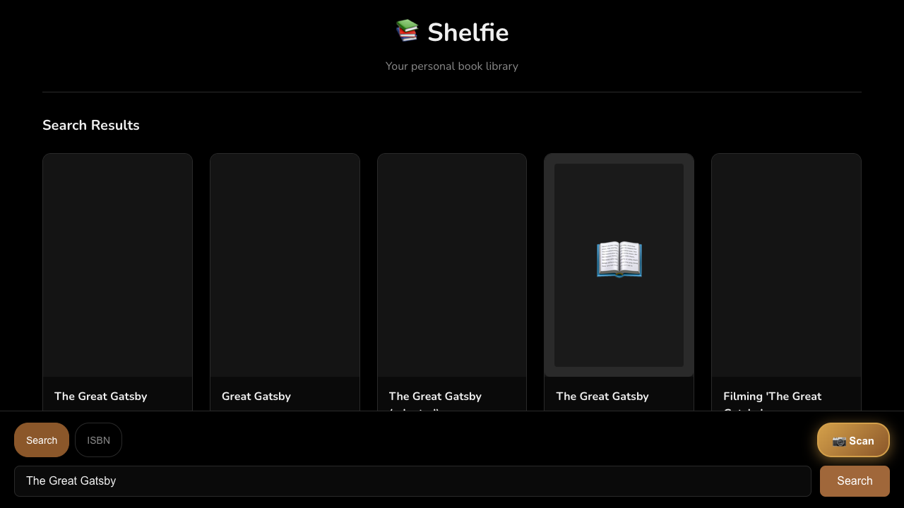
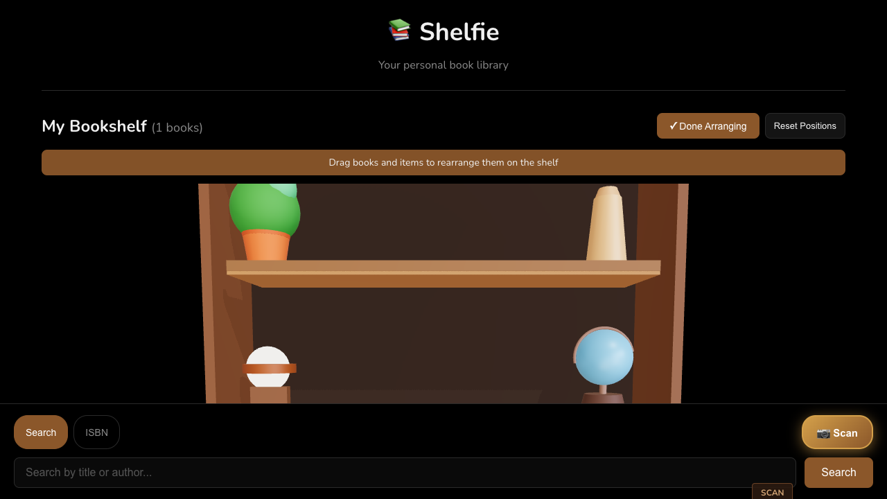
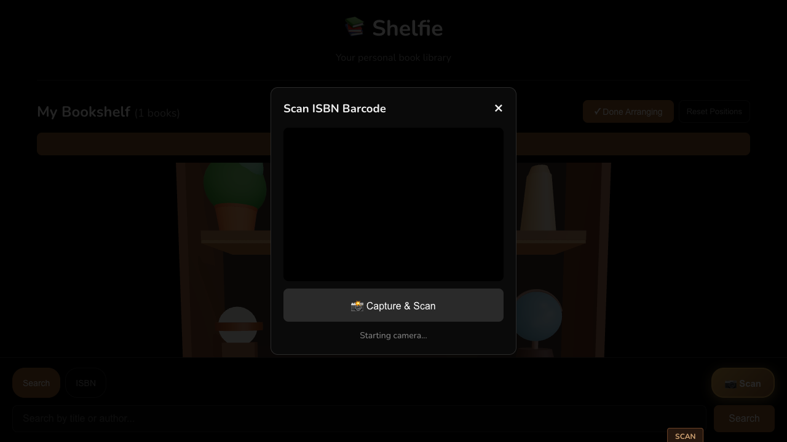

# 📚 Shelfie

A beautiful 3D virtual bookshelf app to catalog and display your personal book library. Built with React, Three.js, and the Open Library API.


<!-- TODO: Add screenshot of the main bookshelf view -->

## ✨ Features

- **3D Interactive Bookshelf** - Browse your library on a realistic wooden bookshelf with decorative items
- **Drag & Drop Arrangement** - Rearrange books and decorations on your shelf
- **Persistent Storage** - Your library and shelf arrangements are saved locally
- **Book Details** - View cover art, author, page count, and publication info
- **Book Search** - Search the Open Library database by title, author, or ISBN
- **ISBN Barcode Scanner** - Scan book barcodes with your camera to quickly add books

## 🚀 Getting Started

### Prerequisites

- Node.js 18+
- npm or yarn

### Installation

```bash
# Clone the repository
git clone <repository-url>
cd shelfie

# Install dependencies
npm install

# Start development server
npm run dev
```

The app will be available at `http://localhost:5173`

## 📖 Usage

### Adding Books

1. **Search** - Type a book title or author in the search bar
2. **ISBN Lookup** - Enter an ISBN directly for precise results  
3. **Scan Barcode** - Click the scan button to use your camera


<!-- TODO: Add screenshot of search results -->

### Managing Your Library

- **Click a book** to view its details and remove it from your library
- **Arrange mode** - Click "Arrange Items" to drag and reposition books
- **Orbit controls** - Click and drag to rotate the bookshelf view


<!-- TODO: Add screenshot of book details modal -->

## 🛠️ Tech Stack

- **React 19** - UI framework
- **Three.js / React Three Fiber** - 3D rendering
- **React Three Drei** - Three.js helpers and components
- **Vite** - Build tool and dev server
- **html5-qrcode** - Barcode scanning
- **Open Library API** - Book data and cover images

## 📁 Project Structure

```
shelfie/
├── src/
│   ├── components/
│   │   ├── Bookshelf3D.jsx    # 3D bookshelf scene
│   │   ├── BarcodeScanner.jsx # Camera barcode scanner
│   │   ├── BookDetails.jsx    # Book info modal
│   │   ├── SearchBar.jsx      # Search input
│   │   └── SearchResults.jsx  # Search result cards
│   ├── hooks/
│   │   └── useLibrary.js      # Library state management
│   ├── services/
│   │   ├── openLibrary.js     # Open Library API client
│   │   └── storage.js         # Local storage utilities
│   ├── App.jsx
│   └── main.jsx
├── public/
└── package.json
```

## 🎨 Screenshots

| Main Bookshelf | Arrange Mode |
|----------------|--------------|
|  |  |
<!-- TODO: Add actual screenshots -->

| Book Details | Barcode Scanner |
|--------------|-----------------|
|  |  |
<!-- TODO: Add actual screenshots -->

## 📜 Scripts

| Command | Description |
|---------|-------------|
| `npm run dev` | Start development server |
| `npm run build` | Build for production |
| `npm run preview` | Preview production build |
| `npm run lint` | Run ESLint |

## 🤝 Contributing

Contributions are welcome! Please feel free to submit a Pull Request.

## 📄 License

This project is open source and available under the [MIT License](LICENSE).

## 🙏 Acknowledgments

- [Open Library](https://openlibrary.org/) for their free book API
- [React Three Fiber](https://github.com/pmndrs/react-three-fiber) for making 3D in React accessible
